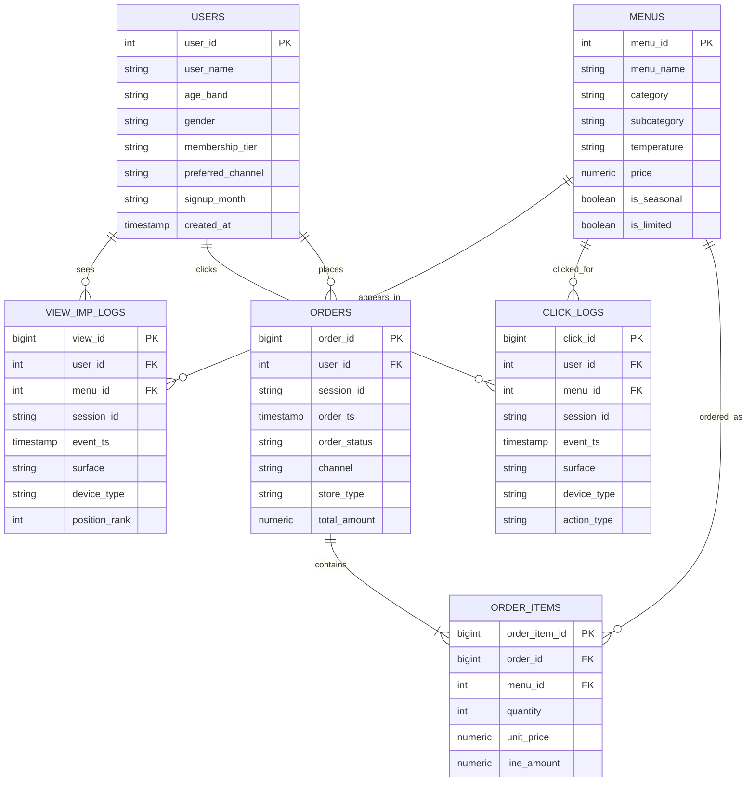

# Starbucks Online App ERD

이 문서는 `Starbucks Online App 분석 통합 프로젝트`의 기준 스키마를 정리한 ERD입니다.
분석 대상은 내부 운영 분석가이며, 핵심 질문은 `노출 -> 클릭 -> 주문` 퍼널과 메뉴/카테고리별 매출 성과입니다.

## Mermaid ERD

## 테이블 역할

- `users`: 사용자 프로필과 세그먼트 분석의 기준 테이블
- `menus`: 메뉴 마스터. 카테고리, 가격, 시즌성 같은 속성을 보관
- `view_imp_logs`: 앱 화면에서 메뉴가 노출된 로그
- `click_logs`: 메뉴 카드/배너/추천 영역에서 클릭한 로그
- `orders`: 주문 단위 헤더. 한 주문의 총액과 상태를 담음
- `order_items`: 주문 상세 라인. 어떤 메뉴가 몇 개 팔렸는지 담음

## 핵심 KPI 연결

- `노출 수`: `view_imp_logs`
- `클릭 수`: `click_logs`
- `CTR`: `clicks / impressions`
- `주문 전환`: `orders / clicks`
- `매출`: `orders.total_amount`, `order_items.line_amount`
- `재주문 패턴`: `orders`를 사용자 기준으로 시계열 집계

## 설계 메모

- `orders`와 `order_items`를 분리해 한 주문에 여러 메뉴가 들어가는 현실적인 구조를 유지합니다.
- `session_id`를 `view_imp_logs`, `click_logs`, `orders`에 같이 넣어 퍼널을 교육용으로 추적하기 쉽게 만듭니다.
- 모든 테이블/컬럼은 노트북에서 `COMMENT ON`으로 설명을 붙여 Text-to-SQL 정확도를 높입니다.
